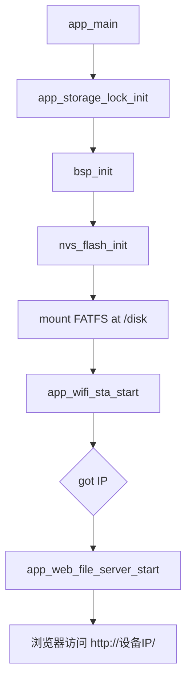

# ESP32-S3 Web 文件系统管理固件

本项目当前只保留 ESP32-S3 通过 Wi-Fi 暴露内部 FAT 文件系统的功能。设备启动后挂载 `/disk`，连接指定 Wi-Fi，获取 IP 后启动 HTTP 文件管理页面。

## 当前功能

- FATFS 挂载点：`/disk`
- Web 登录页：`GET /`
- Web 文件管理页：`GET /app`
- 登录接口：`POST /api/login`
- 登出接口：`POST /api/logout`
- 登录状态：`GET /api/auth/status`
- 文件列表：`GET /files`
- 文件下载：`GET /download?path=...`
- 文件上传：`POST /upload?filename=...`
- 文件删除：`POST /delete`

已移除运行路径中的 LCD、ST7789、LVGL、Gui Guider、本地按键任务、目标芯片烧录任务、ESP32 Web OTA 和 OTA 分区。

## 启动流程



## 主要源码

| 路径 | 说明 |
| --- | --- |
| `main/main.c` | 固件入口，初始化存储锁、BSP、Wi-Fi，并在 got-IP 回调里启动 Web 文件服务器。 |
| `components/BSP/bsp.c` | 初始化 NVS 并挂载 `/disk`。 |
| `components/BSP/STORAGE/storage_flash.c` | wear-levelled FATFS 挂载/卸载。 |
| `components/app_storage_lock/` | Web 文件操作共享互斥锁。 |
| `components/app_wifi/` | Wi-Fi STA 连接和 IP 回调。 |
| `components/app_web_file_server/` | HTTP 登录、文件列表、上传、下载、删除接口和嵌入式页面。 |
| `partitions.csv` | 单 factory app + 大 FAT storage 分区。 |

## 分区表

```csv
# Name,   Type, SubType,  Offset,    Size,     Flags
nvs,      data, nvs,      0x9000,    0x4000,
phy_init, data, phy,      0xf000,    0x1000,
factory,  app,  factory,  0x10000,   0x200000,
storage,  data, fat,      0x210000,  0xDF0000,
```

## 构建

本机验证使用 ESP-IDF 5.5.4：

```powershell
$env:IDF_TOOLS_PATH='C:\Espressif'
$env:IDF_PATH='C:\Espressif_5_5_4\.espressif\v5.5.4\esp-idf'
. "$env:IDF_PATH\export.ps1"
idf.py build
```

最近一次构建产物：

- `build/ESP32S3_Web_File_Manager.bin`
- app 大小约 `0xd5ae0`，`factory` 分区 `0x200000`，剩余约 58%。
