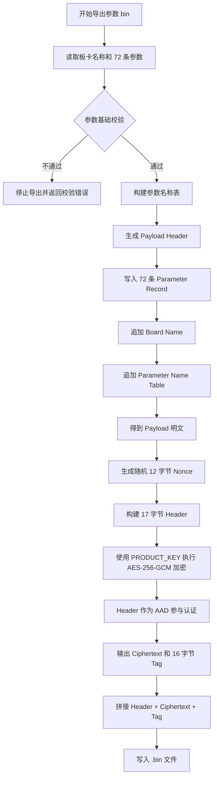
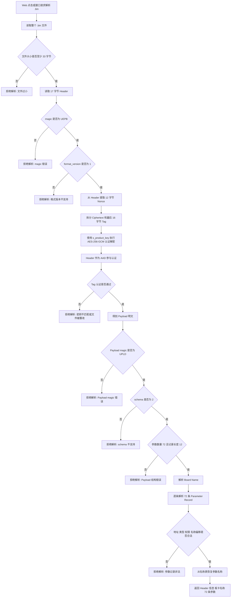

# ESP32-S3 加密参数 bin Web 解析固件

该版本在原有 ESP32-S3 Web 文件管理固件基础上，新增了 tools 生成的加密参数 `.bin` 文件解析能力。

## 新增功能

- 保留 `/disk` FATFS 挂载、登录、上传、下载、删除功能。
- Web 左侧显示 `/disk` 根目录下的 `.bin` 文件列表。
- 点击某个 `.bin` 后，ESP32-S3 后端读取文件并执行 AES-256-GCM 解密认证。
- 解密成功后解析 Payload，显示 72 个参数：地址、名称、默认值、参数类型、权限。
- 密钥只保存在 ESP32 C 代码中，网页 HTML/JS 不包含密钥。

## 新增接口

| 接口 | 方法 | 说明 |
| --- | --- | --- |
| `/api/bin/parse?path=/xxx.bin` | GET | 解析指定加密参数 bin，返回 header 与 72 个参数 |
| `/api/param/readback` | POST | 使用 GPIO4/GPIO5 UART 从当前板卡回读 72 个参数，并返回当前 bin 的可见参数值 |
| `/api/param/download` | POST | 将当前 bin 的可见参数值合并到 72 参数数组后，通过 GPIO4/GPIO5 UART 写入板卡 |
| `/files` | GET | 文件列表中新增 `is_param_bin`、`kind`、`kind_label` 字段 |

## bin 文件格式与加密规则

ESP32-S3 端的解析规则与 PC tools 当前导出的加密参数 `.bin` 格式保持一致。文件整体采用“明文容器头 + AES-256-GCM 加密 Payload + GCM 认证标签”的结构：

```text
[17-byte Header][AES-GCM Ciphertext][16-byte GCM Tag]
```

### 外层文件结构

| Offset | 长度 | 字段 | 取值 / 说明 |
| ---: | ---: | --- | --- |
| `0` | `4` | `magic` | 固定 ASCII：`UEPB` |
| `4` | `1` | `format_version` | 当前固定为 `1` |
| `5` | `12` | `nonce` | 每次导出随机生成的 AES-GCM Nonce |
| `17` | `N` | `ciphertext` | Payload 明文经 AES-256-GCM 加密后的密文 |
| `17 + N` | `16` | `tag` | AES-GCM 认证标签 |

外层 Header 总长度固定为 `17` 字节：

```text
Header = "UEPB" || format_version(1 byte) || nonce(12 bytes)
```

ESP32 端校验规则：

- 文件最小长度必须大于等于 `17 + 16 = 33` 字节。
- `magic` 必须是 `UEPB`。
- `format_version` 必须是 `1`。
- `nonce` 直接来自 Header 的第 `5~16` 字节。
- Header 本身不加密，但会作为 AES-GCM 的 AAD 参与认证；因此修改 `magic`、版本号或 `nonce` 都会导致认证失败。

### AES-256-GCM 规则

| 项目 | 规则 |
| --- | --- |
| 算法 | `AES-256-GCM` |
| Key 长度 | `32` 字节 / `256` bit |
| Nonce 长度 | `12` 字节 |
| Tag 长度 | `16` 字节 |
| AAD | 完整 `17` 字节 Header |
| 明文 | Payload 数据 |
| 密文区 | `ciphertext || tag`，ESP32 端将最后 `16` 字节视为 tag |

当前演示密钥必须与 tools 端一致：

- PC tools：`tools/src-tauri/src/crypto.rs` 中的 `PRODUCT_KEY`
- ESP32-S3：`components/app_param_bin/app_param_bin.c` 中的 `s_product_key`

> 量产前必须将当前演示密钥替换为正式的 32 字节随机密钥，并确保 PC tools 与 ESP32-S3 固件使用完全相同的 key。该 key 不会写入 `.bin` 文件，只存在于导出工具和固件代码中。

### PC tools 加密导出流程



导出阶段的关键点：

- `Header` 明文写入 `.bin` 文件头，用于识别格式、版本和 Nonce。
- `Header` 同时作为 AES-GCM 的 AAD，因此 Header 被篡改后无法通过认证。
- `Board Name`、72 条参数记录和参数名称表都在 Payload 内，均会被加密。
- `Tag` 是认证标签，不是额外明文数据；ESP32-S3 解密时必须校验通过才能使用 Payload。

### ESP32-S3 解密解析流程



解密阶段的关键点：

- ESP32-S3 不会在认证失败时继续解析 Payload。
- AES-GCM 认证失败通常表示 key 不一致、Header 被改动、密文被改动或 tag 被改动。
- 只有通过 Header 校验、AES-GCM 认证和 Payload 结构校验后，Web 页面才会显示参数。
- 隐藏参数仍存在于加密 Payload 中，但 Web 展示和下载逻辑会按 `permission` 区分可见与隐藏。

### 加密 Payload 明文结构

AES-GCM 解密成功后得到 Payload 明文。当前 Payload schema 为 `3`，所有多字节整数均为 Little-Endian：

```text
[20-byte Payload Header][Parameter Record x 72][Board Name][Parameter Name Table]
```

#### Payload Header

| Offset | 长度 | 字段 | 取值 / 说明 |
| ---: | ---: | --- | --- |
| `0` | `4` | `payload_magic` | 固定 ASCII：`UPLD` |
| `4` | `2` | `schema_version` | 当前固定为 `3` |
| `6` | `1` | `param_count` | 固定为 `72` |
| `7` | `1` | `record_size` | 固定为 `12` |
| `8` | `2` | `board_name_len` | 板卡名称 UTF-8 字节长度，必须大于 `0` |
| `10` | `2` | `name_table_len` | 参数名称表 UTF-8 总字节长度 |
| `12` | `2` | `payload_flags` | 当前保留，写入 `0` |
| `14` | `2` | `reserved` | 当前保留，写入 `0` |
| `16` | `4` | `payload_crc` | 当前保留，写入 `0` |

#### 参数记录格式

每条参数记录固定 `12` 字节，共 `72` 条，紧跟在 `20` 字节 Payload Header 后：

| Record Offset | 长度 | 字段 | 取值 / 说明 |
| ---: | ---: | --- | --- |
| `0` | `1` | `address` | 参数地址，范围 `0~71`，不可重复 |
| `1` | `1` | `param_type` | `0` = 控制参数，`1` = 保护参数 |
| `2` | `1` | `permission` | `0` = 隐藏，`1` = 可见 |
| `3` | `1` | `reserved0` | 当前保留，写入 `0` |
| `4` | `4` | `default_value` | 默认参数值，`uint32`，单位 ns |
| `8` | `2` | `name_offset` | 参数名称在名称表中的字节偏移 |
| `10` | `2` | `name_len` | 参数名称 UTF-8 字节长度 |

#### 字符串区域

参数记录之后依次追加：

1. `Board Name`：长度由 `board_name_len` 指定，UTF-8 编码，ESP32 当前显示限制为最多 `96` 字节。
2. `Parameter Name Table`：所有参数名称按记录顺序拼接，无分隔符；每条记录通过 `name_offset + name_len` 定位自己的名称，单个参数名 ESP32 当前显示限制为最多 `96` 字节。

ESP32 端会校验 Payload magic、schema 版本、参数数量、记录长度、板卡名称长度、参数地址范围与唯一性、参数类型、权限值，以及名称表偏移是否越界。任一校验失败都会拒绝解析该 `.bin` 文件。

## 参数板卡串口

参数回读和参数下载使用 `components/app_param_board/` 中的 UART 协议实现，默认连接为 `UART1 TX=GPIO4`、`UART1 RX=GPIO5`、`921600 8N1`。协议沿用板卡 82 字节帧格式，72 个 `uint16_t` 参数分两帧读写。

## 构建

本工程按 ESP-IDF 5.5.x 组织。首次使用建议：

```powershell
idf.py set-target esp32s3
idf.py build
idf.py flash monitor
```

如果使用你原来的固定环境：

```powershell
$env:IDF_TOOLS_PATH='C:\Espressif'
$env:IDF_PATH='C:\Espressif_5_5_4\.espressif\v5.5.4\esp-idf'
. "$env:IDF_PATH\export.ps1"
idf.py set-target esp32s3
idf.py build
```

## 默认登录

- 用户名：`admin`
- 密码：`admin`

正式产品建议改为 NVS 配置、一次性密码或设备授权码方案。

## Wi-Fi 配置

当前固件使用硬编码 SoftAP 配置：

```c
#define APP_WIFI_AP_SSID "Uniedge驱动器参数更新"
#define APP_WIFI_AP_PASSWORD "12345678"
```

路径：`components/app_wifi/app_wifi.c`
AP 默认地址：`http://192.168.4.1/`
